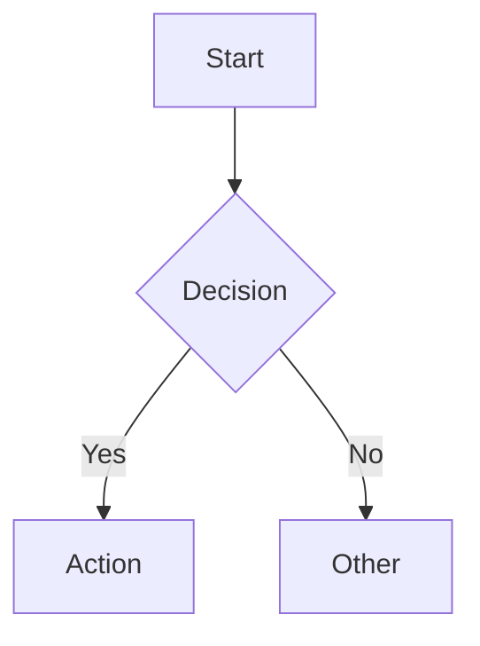

# Flow Chart Template (Mermaid)

## When to load

Load to draw a flow chart at `docs/domains/{domain}/flows/{flow}.md`.

## Template

```markdown
# {Flow name}


```

## Rules

- EN labels only (do not translate labels).
- One flow per file.
- Reference the flow from the feature doc.
